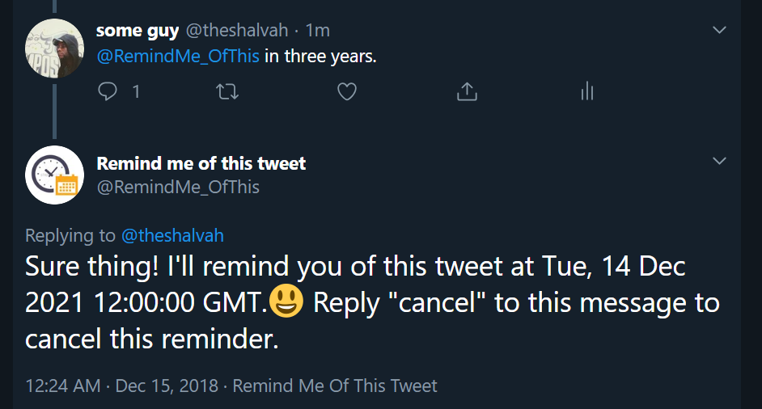

# RemindMeOfThisTweet

**The Problem:**

Some guy on Twitter tweets:
> In three years, humans will have established a colony on Uranus.

And of course, naturally, you want to check back in three years to see if he was right. But you likely won't remember by that time.

**The Solution:**

Just tweet:
> @RemindMe_OfThis in three years

And when the time is right:

Of course, that's not all you can do! You can set reminders for your own tweets (New Year's Resolutions, anyone?👀), too, for instance.

## How This Works
## Stack
- [AWS Lambda](https://aws.amazon.com/lambda/) with the [Serverless Framework](http://serverless.com)
- [AWS CloudWatch Events](https://docs.aws.amazon.com/AmazonCloudWatch/latest/events/WhatIsCloudWatchEvents.html)
- [Redis](http://redis.io)
- Node.js 8.10

### Implementation
The bot uses a number AWS Lambda functions that work in tandem:

#### fetchTweetsAndSetReminders
This function runs once every minute and checks for new mentions. For each mention, it parses it and attempts to set any reminders or cancellations requested.

It sets a reminder by scheduling a CloudWatch event to be triggered at the specified time. This event has the `remind` Lambda function (see below) as its target and the referenced tweet as its payload, so when the event is fired, it triggers the Lambda function and passes in the payload.

Cancellations work by tracking scheduled events by the reply ID in Redis. When a mention includes "cancel", the function will search for the Redis entry matching the ID of the tweet being replied to and delete the corresponding CloudWatch event.

#### remind
This handles the actual reminding. It sends the tweet to the user who requested it and then "cleans up" by deleting the CloudWatch event that triggered it.

#### retryFailedTasks
This re-publishes failed tasks (stored in Redis) and attempts to set reminders for them. It can only be triggered manually.

